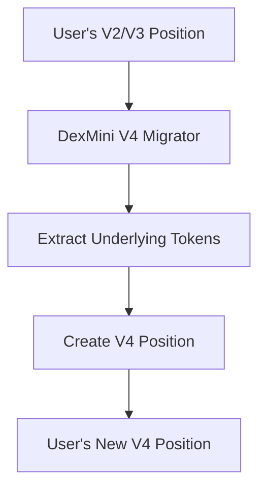

# 🔄 DexMini V2 & V3 to V4 Migrator

<div align="center">
  <h3>Migrate your Uniswap V2 and V3 Liquidity Pools to Uniswap V4 with 1-click.</h3>
</div>

## 🎯 Overview

DexMini V4 Migrator is a specialized protocol designed to facilitate the seamless migration of liquidity positions from Uniswap V2 and V3 to Uniswap V4. It provides a secure and efficient pathway for liquidity providers to transition their assets to the next generation of Uniswap.

## ✨ Features

🔒 **Secure Migration** - Safe transfer of liquidity with slippage protection and deadline checks

🔄 **Multi-Version Support** 
- V2 LP Token Migration
- V3 NFT Position Migration
- Direct V4 Position Creation

⚡ **Optimized Gas** - Efficient migration process with minimal transactions

🛡️ **Battle-tested** - Comprehensive test coverage and security considerations

## 🔧 How It Works



## 📁 Repository Structure

```
/src                # Core contract implementations
  └─ interfaces     # Protocol interfaces
/test               # Test suites
  └─ mocks          # Mock contracts for testing
/script             # Deployment scripts
/docs               # Documentation & diagrams
```

## ⚙️ Installation & Setup

### Prerequisites

- [Foundry](https://book.getfoundry.sh/getting-started/installation.html)
- Solidity ^0.8.0
- Git

### Quick Start

```bash
# Clone the repository
git clone https://github.com/DexMini/v4-migrator.git
cd v4-migrator

# Install dependencies
forge install

# Build
forge build

# Run tests
forge test
```

## 🚀 Deployment

1. Set up your environment variables:
```bash
cp .env.example .env
# Edit .env with your deployment keys and RPC URLs
```

2. Deploy to network:
```bash
forge script script/DeployDexMiniV4Migrator.s.sol:DeployDexMiniV4Migrator \
    --rpc-url <YOUR_RPC_URL> \
    --broadcast \
    --verify
```

## 📖 Documentation

- [Migration Flow](docs/MIGRATION_FLOW.md)
- [Technical Specification](docs/SPECIFICATION.md)

## 🔐 Security

- All migrations are atomic
- Slippage protection built-in
- Deadline checks for transactions
- Emergency pause functionality
- Comprehensive test coverage

## 🤝 Contributing

We welcome contributions! Please see our [Contributing Guidelines](CONTRIBUTING.md) for details.

## 📄 License

This project is licensed under the GPL-2.0-or-later License - see the [LICENSE](LICENSE) file for details.

## 🌐 Links

- [Website](https://dexmini.com)
- [Documentation](https://docs.dexmini.com)
- [Twitter](https://twitter.com/DexMini)

## 💬 Support

For support, please join our [Discord](https://discord.gg/dexmini) or [Telegram](https://t.me/dexmini) community.
