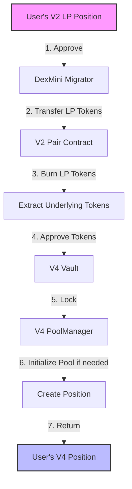
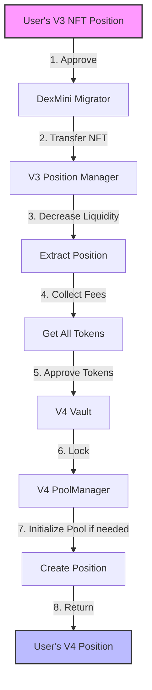

# DexMini Migration Flow

## Overview

This document details the step-by-step process of migrating liquidity positions from Uniswap V2 and V3 to V4 using the DexMini Migrator.

## Migration Flows

### V2 to V4 Migration Flow



### V3 to V4 Migration Flow



## Detailed Steps

### V2 to V4 Migration

1. **User Approval**
   - User approves migrator to spend V2 LP tokens
   - Function: `pair.approve(migrator, amount)`

2. **Transfer LP Tokens**
   - Migrator receives LP tokens from user
   - Function: `pair.transferFrom(user, migrator, amount)`

3. **Extract Tokens**
   - Burn LP tokens to receive underlying tokens
   - Function: `pair.burn(address(this))`

4. **V4 Position Creation**
   ```solidity
   struct MigrationParams {
       PoolKey poolKey;      // V4 pool parameters
       uint160 sqrtPriceX96; // Initial price if pool needs initialization
       int24 tickLower;      // Position lower tick
       int24 tickUpper;      // Position upper tick
       uint256 amount0Min;   // Minimum token0 amount
       uint256 amount1Min;   // Minimum token1 amount
       uint256 deadline;     // Transaction deadline
   }
   ```

### V3 to V4 Migration

1. **NFT Transfer**
   - User approves and transfers V3 NFT to migrator
   - Function: `positionManager.safeTransferFrom(user, migrator, tokenId)`

2. **Position Extraction**
   ```solidity
   // Decrease liquidity to zero
   positionManager.decreaseLiquidity({
       tokenId: tokenId,
       liquidity: position.liquidity,
       amount0Min: 0,
       amount1Min: 0,
       deadline: deadline
   });

   // Collect all tokens and fees
   positionManager.collect({
       tokenId: tokenId,
       recipient: address(this),
       amount0Max: type(uint128).max,
       amount1Max: type(uint128).max
   });
   ```

3. **V4 Position Creation**
   - Initialize V4 pool if needed
   - Create new position with extracted tokens
   - Transfer V4 tokens to user

## Security Checkpoints

🔒 **Pre-Migration Checks**
- Valid token addresses
- Non-zero liquidity amounts
- Pool parameters validation
- Token sorting verification

⏱️ **During Migration**
- Deadline validation
- Slippage protection
- Atomic execution
- Proper token handling

✅ **Post-Migration Checks**
- Position created successfully
- No residual tokens in contract
- All approvals revoked 