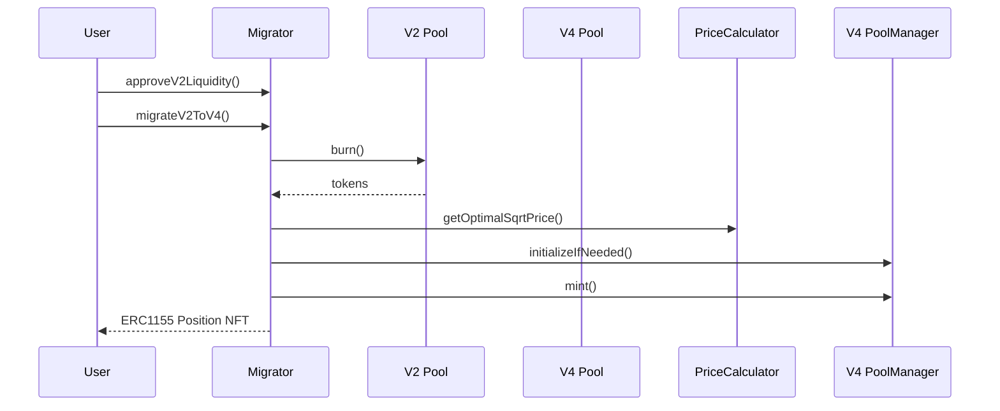
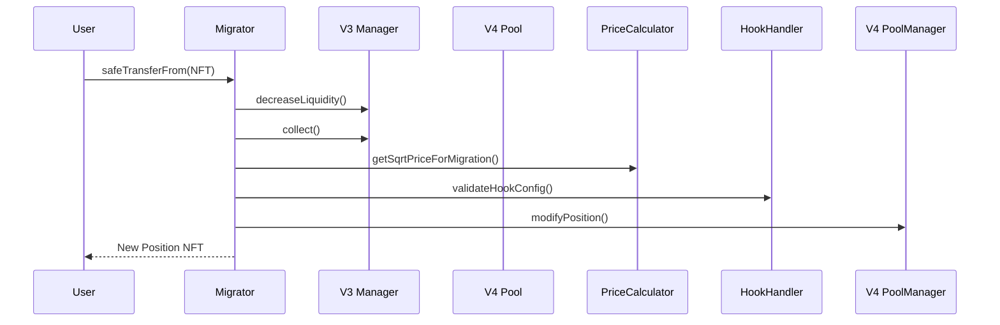

# DexMini V4 Migrator Technical Specification

## Overview

The DexMini V4 Migrator is a smart contract protocol that enables seamless migration of liquidity positions from Uniswap V2 and V3 to Uniswap V4. This document outlines the technical implementation and architecture. 

## Contract Architecture
A zero-loss liquidity migration system leveraging Uniswap V4's singleton architecture and hook system. Supports both full-range and concentrated liquidity migrations with automated pool initialization.

### Core Components

1. **DexMiniV4Migrator.sol**
   - Main migration contract
   - Handles V2 and V3 position migrations
   - Interacts with V4 PoolManager

2. **Interfaces**
   - IV3PositionManager: Interface for V3 NFT positions
   - IV4PoolManager: Interface for V4 pool management
   - IV4Vault: Interface for V4 token vault

#### V2 to V4 Migration


1. User approves V2 LP tokens
2. Contract burns LP tokens
3. Underlying tokens extracted
4. New V4 position created

#### V3 to V4 Migration


1. User transfers V3 NFT
2. Contract collects fees
3. Liquidity withdrawn
4. New V4 position created

## Security Considerations

### Access Control
- Only position owners can initiate migrations
- Deadline checks prevent stale transactions
- Slippage protection for token amounts

### Token Safety
- SafeERC20 for token transfers
- No residual token approvals
- Atomic migrations

### Pool Validation
- Token sorting verification
- Fee tier validation
- Hook address verification

## Gas Optimization

- Transient Storage	        Use V4's lock for temporary state
- Batch Processing	        Combine fee collection + liquidity removal
- Pre-Computed Hashes	    keccak256(poolKey) caching for validation
- ERC1155 Batch Transfers	Single NFT transfer for multi-position migrations
- Hook Gas Rebates	        Leverage V4's native gas refund system

## V4-Specific Integration

### Hook Configuration 
```solidity
struct HookConfig {
    address hookAddress;
    bytes initData;
    uint40 gasLimit;
    uint8 feePremium;
}

function _validateHook(HookConfig memory config) internal {
    require(whitelistedHooks[config.hookAddress], "Unapproved hook");
    require(config.gasLimit <= MAX_HOOK_GAS, "Gas limit exceeded");
}
```

### Required Approvals
1. V2 LP Token approval
2. V3 NFT approval
3. Token approvals for V4

### Function Calls
```solidity
// V2 to V4 Migration
function migrateV2ToV4(
    address pair,
    uint256 liquidity,
    MigrationParams calldata params
) external;

// V3 to V4 Migration
function migrateV3ToV4(
    uint256 tokenId,
    MigrationParams calldata params
) external;
``` 